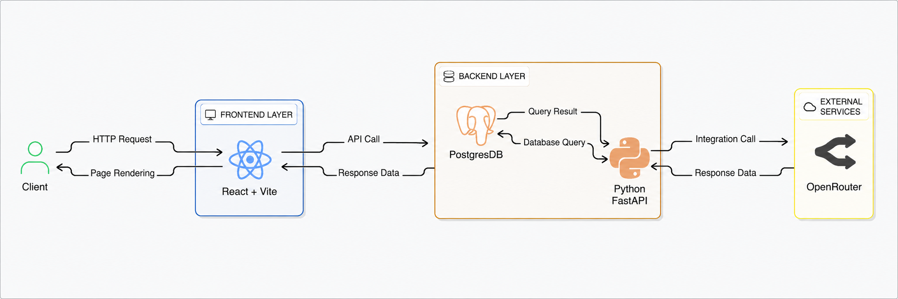
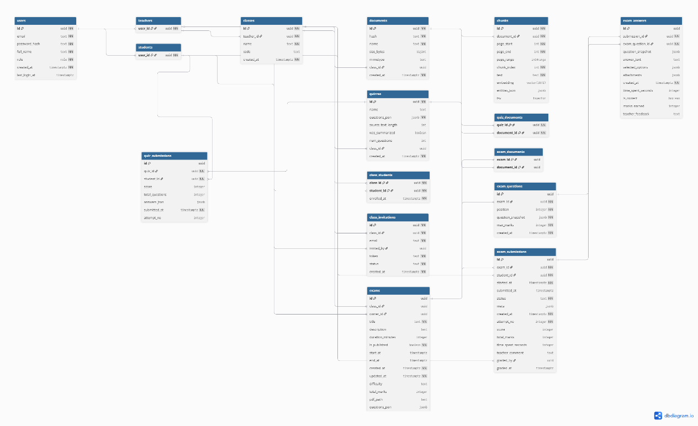
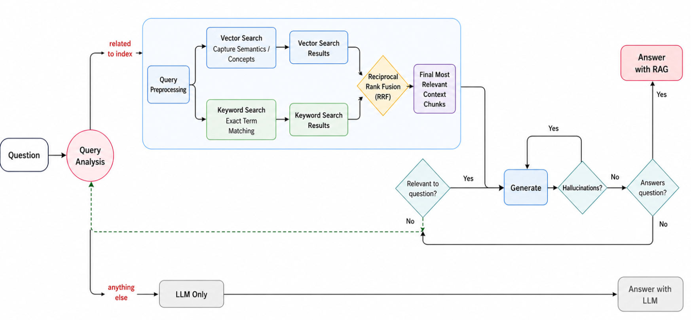
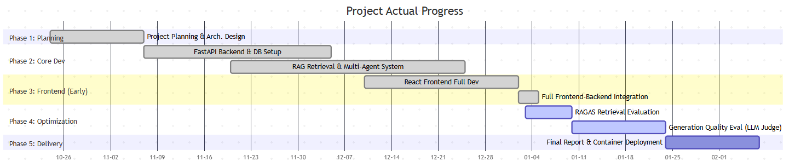
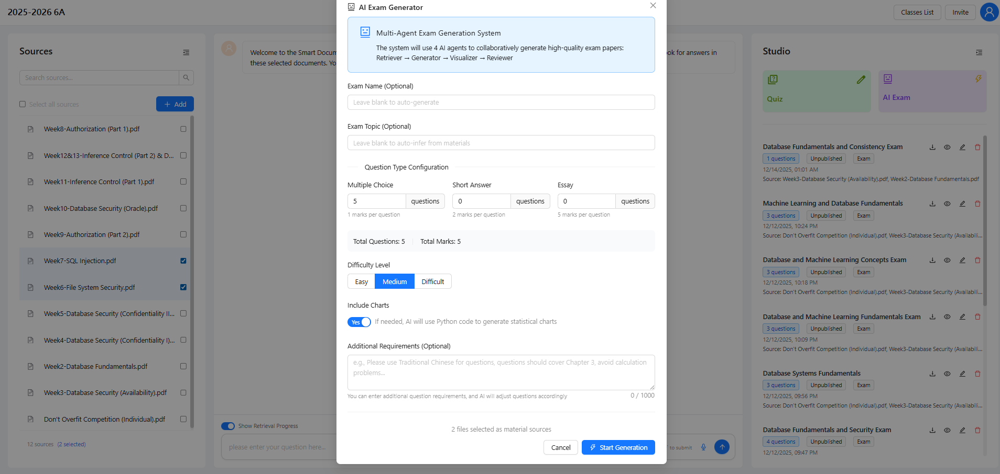
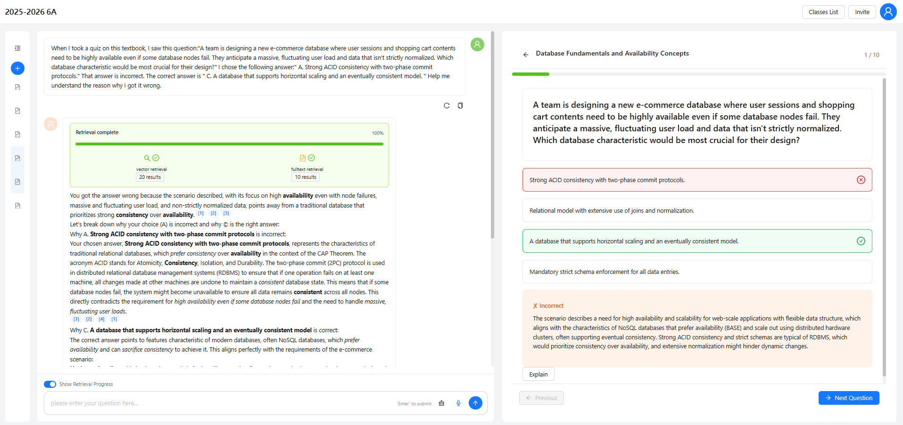
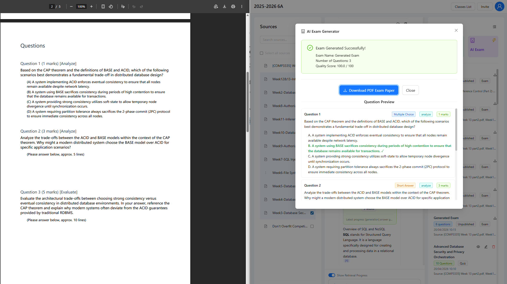
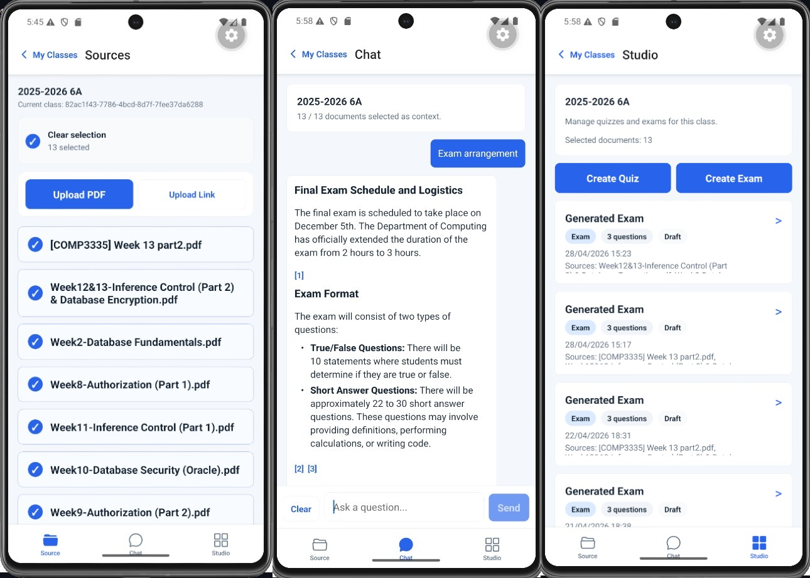

# PolyU FYP Learning Platform

This repository contains an educational assessment platform built for the PolyU FYP project. It combines Retrieval-Augmented Generation (RAG), a multi-agent exam-generation workflow, and both web and mobile teaching interfaces to help teachers manage materials, generate assessments, and support student learning with grounded AI outputs.

## Project Overview

Modern educational assessment faces two recurring problems: manual feedback is time-consuming, and general-purpose LLM output can be unreliable for high-stakes academic use. This project addresses those issues with an integrated system that grounds AI responses in teacher-provided materials and uses structured agent workflows to improve question quality, answerability, and pedagogical alignment.

The platform is centered on the **Intelligent Exam Studio**, a workflow-driven environment for generating exams and quizzes from course materials. It uses RAG to retrieve evidence from uploaded documents, supports Bloom's Taxonomy-aware question generation, and keeps document management, classroom workflows, and assessment tools in one application.

## Demo Video

Watch the project demo video: [https://www.youtube.com/watch?v=HmWtOWc2jEk](https://www.youtube.com/watch?v=HmWtOWc2jEk)

Related legacy project: [RAG_js](https://github.com/ovoowovo1/RAG_js) is an older RAG implementation built with JavaScript and a Neo4j database. It has fewer features than this maintained FYP platform, but may be useful for reference if you are interested.

## Key Capabilities

- Grounded Q&A over teacher-provided course materials
- Standardized exam generation with a multi-agent workflow
- Rapid quiz generation for lower-latency formative assessment
- Automated grading support for quizzes and short-answer assessments
- Bloom's Taxonomy control for difficulty and cognitive-depth alignment
- Integrated class, document, and assessment workflow in one web app

Current repository implementation note:

- The live repository now uses adaptive retrieval / adaptive RAG in the current grounded Q&A and exam retrieval implementation.
- This is a post-FYP repository update to the maintained codebase, not part of the assessed FYP submission snapshot.

## Architecture and Workflow

The system follows a decoupled full-stack architecture: React/Vite and Expo frontends communicate with a FastAPI backend, which coordinates retrieval, generation, grading, and storage services over PostgreSQL and model APIs.



*Figure 3.1. High-level system architecture showing the client, React/Vite frontend, FastAPI backend, PostgreSQL data layer, and external model service integration.*



*Figure 3.2. Entity relationship design for users, classes, documents, and chunk-level storage used to support retrieval and source grounding.*



*Figure 3.3. RAG system pipeline demonstrating document ingestion, embedding generation, context retrieval, and AI model response generation.*


*Figure 3.4. Multi-agent state graph used by the exam-generation workflow, where retrieval, generation, visualization, and review are coordinated through explicit state transitions.*

## Product Preview

The current system already integrates the main teacher workflow: document selection, exam setup, AI-assisted generation, and interactive assessment support inside one interface.



*Figure 4.1. Project progress snapshot from the final report, reflecting the implementation status achieved during development.*

## Repository Update Note

This README describes both the FYP project context and the repository's ongoing engineering updates. Those two scopes are not identical.

- The FYP final report, assessed submission scope, and Figure 4.1 progress snapshot describe the implementation status reached during the formal project period.
- The current repository may contain post-FYP implementation updates added after that snapshot.
- The adaptive RAG / adaptive retrieval work in the current codebase is one of those post-FYP repository updates.
- These updates improve the maintained implementation, but they should not be read as part of the official FYP progress, milestone record, or assessed deliverable scope.

For a concise record of ongoing repository updates, see [docs/repository-updates.md](docs/repository-updates.md).



*Figure 4.2. Intelligent Exam Studio configuration screen for setting topic, question types, marks, difficulty, chart generation, and additional requirements.*



*Figure 4.3. Interactive assessment experience with pre-computed rationale and source-aware assistance inside the learning workspace.*



*Figure 4.4. AI Exam Generator interface showing a successfully generated exam with question previews and a side-by-side view of the exported PDF exam paper.*



*Figure 4.5. Expo mobile workspace showing the Source, Chat, and Studio screens used for document selection, citation-aware assistance, and generated assessment management.*

## Evaluation Highlights

The final report evaluated retrieval quality in both cross-lingual and monolingual settings. The main findings were:

- Vector retrieval performed best for Chinese-to-English cross-lingual queries, where semantic similarity was more useful than direct lexical overlap.
- Hybrid retrieval provided the best overall trade-off in monolingual English settings by combining semantic matching with stronger keyword recall.

These results support the design choice to use retrieval strategies selectively rather than relying on a single retrieval mode for every classroom scenario.

## Repository Structure

```text
.
|-- backend/
|   |-- RAG_python-quiz/
|-- docs/
|   |-- images/
|       |-- readme/
|-- frontend/
|   |-- vite-project/
|   |-- expo-app/
```

## Tech Stack

- Frontend (Web): React 18, Vite, Ant Design, Redux Toolkit
- Frontend (Mobile): Expo, Expo Router, React Native
- Backend: FastAPI, Pydantic Settings, LangChain, LangGraph
- Database: PostgreSQL with vector-based retrieval support
- Models and APIs: Gemini-family models and OpenAI-compatible embedding endpoints

## Prerequisites

Before running the project locally, install:

- Python 3.12 recommended
- Node.js 20 or newer
- npm
- PostgreSQL
- Provider API keys for Google Gemini/OpenRouter-compatible services

## Backend Setup

From the repository root:

```powershell
cd backend\RAG_python-quiz
python -m venv .venv
.\.venv\Scripts\Activate.ps1
pip install -r requirements.txt
Copy-Item .env.example .env
uvicorn main:app --host 0.0.0.0 --port 3000 --reload
```

If you are using macOS or Linux, replace the activation and copy commands with the shell equivalents:

```bash
source .venv/bin/activate
cp .env.example .env
```

Important notes:

- The backend reads settings from `backend/RAG_python-quiz/.env`.
- PostgreSQL must be reachable before starting the API.
- The application initializes its vector index on startup, so database connectivity is required during launch.

## Web Frontend Setup

From the repository root:

```powershell
cd frontend\vite-project
npm install
Copy-Item .env.example .env
npm run dev
```

The frontend uses `VITE_API_BASE_URL` to decide which backend base URL to call.

## Expo App Setup

From the repository root:

```powershell
cd frontend\expo-app
npm install
Copy-Item .env.example .env
npm run start
```

Useful Expo commands:

```powershell
npm run android
npm run ios
npm run web
npm run start:lan
npm run start:tunnel
```

The Expo app uses `EXPO_PUBLIC_API_BASE_URL` to decide which backend base URL to call.

Notes:

- For the Android emulator, `.env.example` already shows the `10.0.2.2` backend URL pattern.
- For a physical device, set `EXPO_PUBLIC_API_BASE_URL` to a reachable LAN IP such as `http://<your-lan-ip>:3000`.
- The Expo app is an additional client for the same backend used by the web frontend.

## Local Development Workflow

Run the backend first:

```powershell
cd backend\RAG_python-quiz
.\.venv\Scripts\Activate.ps1
uvicorn main:app --host 0.0.0.0 --port 3000 --reload
```

Then start either frontend in a separate terminal.

Web frontend:

```powershell
cd frontend\vite-project
npm run dev
```

Expo app:

```powershell
cd frontend\expo-app
npm run start
```

Default local URLs:

- Web frontend: `http://localhost:5173`
- Expo app: runs through the Expo dev server, emulator, simulator, Expo Go, or web mode
- Backend: `http://localhost:3000`

The backend can be shared by both frontends at the same time.

## Environment Variables

### Web Frontend

The frontend example file is located at `frontend/vite-project/.env.example`.

| Variable | Required | Description |
| --- | --- | --- |
| `VITE_API_BASE_URL` | Yes | Base URL for the FastAPI backend, for example `http://localhost:3000`. |

### Expo App

The Expo app example file is located at `frontend/expo-app/.env.example`.

| Variable | Required | Description |
| --- | --- | --- |
| `EXPO_PUBLIC_API_BASE_URL` | Yes | Base URL for the FastAPI backend, using a URL reachable from the emulator, simulator, or device. |

### Backend

The backend example file is located at `backend/RAG_python-quiz/.env.example`.

Required runtime variables:

| Variable | Description |
| --- | --- |
| `PG_DSN` | PostgreSQL connection string used by the backend services. |
| `JWT_SECRET_KEY` | Secret used to sign and verify auth tokens. |
| `LLM_API_KEYS` | Comma-separated list of runtime LLM API keys used for generation and retry rotation. |

Optional variables with documented defaults:

| Variable | Default | Description |
| --- | --- | --- |
| `PORT` | `3000` | Backend port used by the local server. |
| `LLM_MODEL` | `google/gemini-3-flash-preview` | Main generation model. |
| `GOOGLE_TTS_MODEL` | `gemini-2.5-flash-preview-tts` | Text-to-speech model. |
| `LLM_API_KEY` | empty | Optional single-key override for LLM calls when you do not want to use the pool in `LLM_API_KEYS`. |
| `LLM_BASE_URL` | `https://openrouter.ai/api/v1` | Optional custom base URL for LLM calls. |
| `EMBEDDING_API_KEY` | falls back to `LLM_API_KEY` or the first item in `LLM_API_KEYS` | Optional dedicated embeddings key. |
| `EMBEDDING_BASE_URL` | `https://openrouter.ai/api/v1` | Base URL for the embeddings provider. |
| `EMBEDDING_MODEL` | `google/gemini-embedding-001` | Primary embeddings model. |
| `EMBEDDING_ACTIVE_COLUMN` | `embedding` | Primary PostgreSQL embedding column. |
| `EMBEDDING_FALLBACK_MODEL` | `google/gemini-embedding-2-preview` | Fallback embeddings model. |
| `EMBEDDING_FALLBACK_COLUMN` | `embedding_v2` | Fallback PostgreSQL embedding column. |

The minimal `.env.example` intentionally omits unused legacy `NEO4J_*`, `AURA_*`, `JINA_API_KEY`, and deprecated provider-specific configuration names.

Optional manual smoke and evaluation variables:

| Variable | Description |
| --- | --- |
| `EVAL_LLM_API_KEY` | Credential for manual evaluation utilities that call an OpenAI-compatible chat endpoint. |
| `EVAL_LLM_BASE_URL` | Base URL for the evaluation LLM provider. |
| `EVAL_LLM_MODEL` | Model name used by the evaluation LLM utilities. |
| `EVAL_EMBEDDING_API_KEY` | Credential for evaluation embedding utilities. |
| `EVAL_EMBEDDING_BASE_URL` | Base URL for the evaluation embedding provider. |
| `EVAL_EMBEDDING_MODEL` | Model name used by evaluation embedding utilities. |

Embedding calls reuse the shared LLM credential by default. Set `EMBEDDING_API_KEY` only when embeddings must use a separate provider or quota.

## Testing and Verification

### Backend

```powershell
cd backend\RAG_python-quiz
python -m pytest -q
```

Manual backend smoke and evaluation scripts must load provider credentials from `.env` or shell environment variables. Do not commit live API keys into backend test or evaluation files.

### Web Frontend

```powershell
cd frontend\vite-project
npm install
npm run build
```

### Expo App

```powershell
cd frontend\expo-app
npx tsc --noEmit
```

## API Areas

The current backend exposes these main API areas:

- `/auth`
- `/classes`
- `/quiz`
- `/exam`
- `/api/query-stream`
- `/tts`
- `/upload-multiple`
- `/upload-link`
- `/files`
- `/chunks/{chunk_id}/source-details`

There are also additional routes such as:

- `/query-stream`

## Smoke Check

After both services are running:

1. Open the frontend login page.
2. Confirm the frontend can reach the backend through `VITE_API_BASE_URL`.
3. Sign in and verify the main class and document flows load without obvious API or CORS errors.
