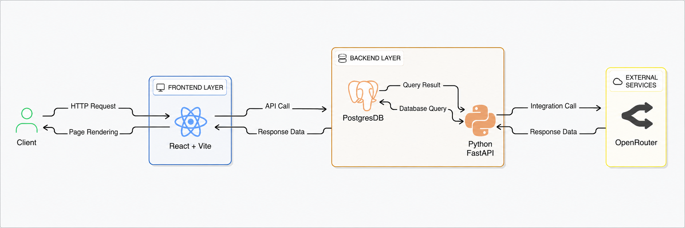
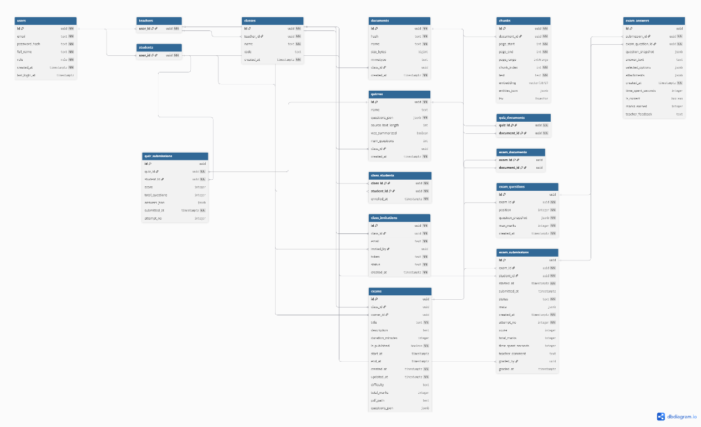
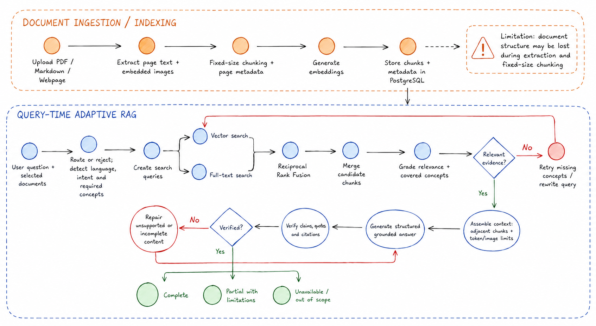
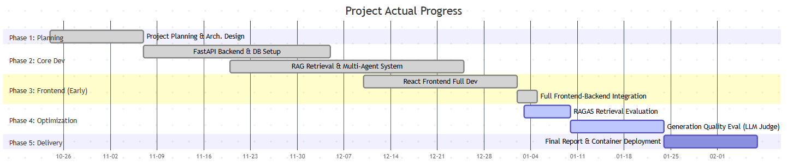
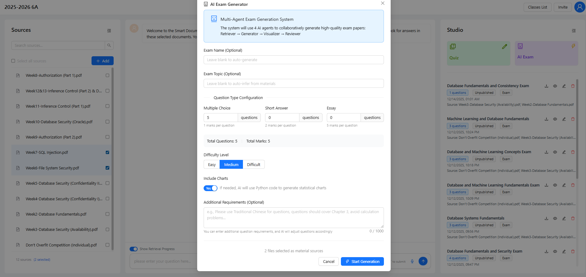
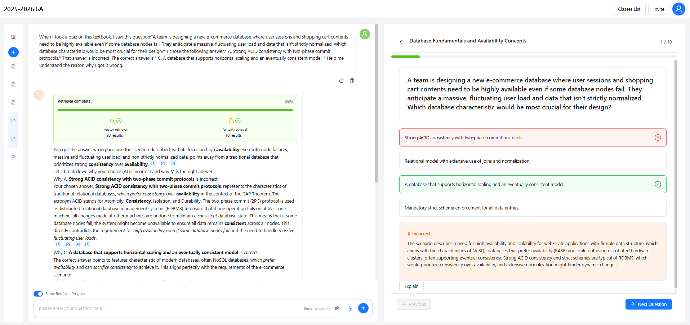
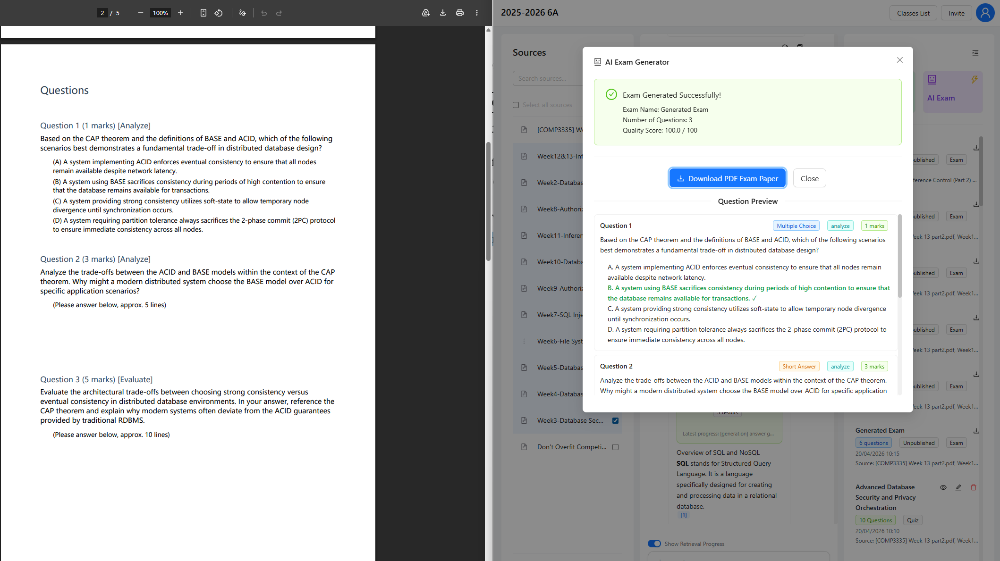
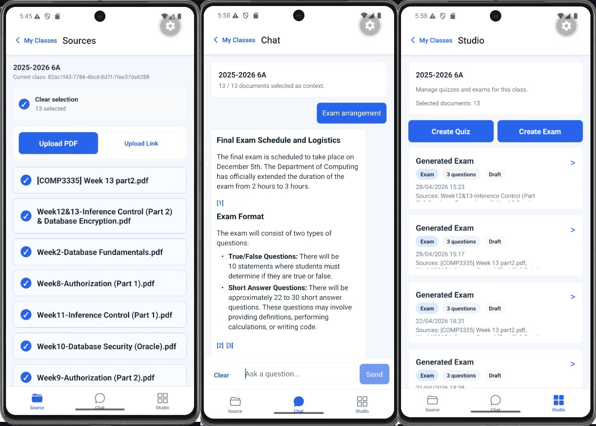

# PolyU FYP 學習平台

[English](README.md)

這個 repository 是為 PolyU FYP 專案建立的教育評量平台，結合 Retrieval-Augmented Generation（RAG）、多代理人考試生成流程，以及網頁與行動教學介面，協助教師管理教材、生成評量內容，並以有依據的 AI 輸出支援學生學習。

## 專案概覽

現代教育評量面臨兩個常見問題：人工回饋耗時，以及通用大型語言模型的輸出未必適合高風險的學術使用。本專案透過教師提供的教材建立 grounded AI 回答，並使用結構化的 agent workflow 改善題目品質、可回答性與教學目標的一致性。

平台以 **Intelligent Exam Studio** 為核心，提供從課程教材生成考試與小測驗的工作流程。系統使用 RAG 從上傳文件中擷取 evidence，支援 Bloom's Taxonomy 對題目難度與認知層次的控制，並將文件管理、課堂流程與評量工具整合在同一個應用程式中。

## Demo 影片

觀看專案 demo 影片：[https://www.youtube.com/watch?v=HmWtOWc2jEk](https://www.youtube.com/watch?v=HmWtOWc2jEk)

相關的 legacy project：[RAG_js](https://github.com/ovoowovo1/RAG_js) 是較早期使用 JavaScript 與 Neo4j 建立的 RAG 實作。它的功能少於目前維護中的 FYP 平台，但如果你有興趣，可以作為參考。

## 主要功能

- 對教師提供的課程教材進行 grounded Q&A
- 使用多代理人流程產生標準化考試
- 快速生成低延遲的形成性小測驗
- 支援小測驗與簡答評量的自動評分
- 使用 Bloom's Taxonomy 控制難度與認知深度
- 在同一個 web app 中整合課堂、文件與評量流程

目前 repository 的實作說明：

- 目前的 grounded Q&A 與考試 retrieval 實作使用 adaptive retrieval／adaptive RAG。
- 這是加入現有維護程式碼的 post-FYP repository update，不屬於正式評核的 FYP submission snapshot。

## 架構與工作流程

系統採用解耦的 full-stack 架構：React/Vite 與 Expo frontend 透過 FastAPI backend 通訊，backend 再協調 retrieval、generation、grading 與 storage services，並使用 PostgreSQL 與 model APIs。



*圖 3.1。高層次系統架構，展示 client、React/Vite frontend、FastAPI backend、PostgreSQL data layer 與外部 model service integration。*



*圖 3.2。users、classes、documents 與 chunk-level storage 的 entity relationship 設計，用於支援 retrieval 與 source grounding。*



*圖 3.3。RAG 系統流程，展示文件 ingestion、embedding generation、context retrieval 與 AI model response generation。*


*圖 3.4。考試生成 workflow 使用的 multi-agent state graph，retrieval、generation、visualization 與 review 透過明確的 state transition 協調。*

## 文件理解 Pipeline：目前限制

目前的 document understanding pipeline 並不是完整的版面與語意理解系統，主要是先抽取 PDF 文字，再以固定大小進行 chunking。這會在進入 RAG retrieval 之前造成以下限制：

- PDF 主要透過 `pypdf` 逐頁抽取文字與 embedded raster images，無法完整保留原始文件的版面資訊。
- 文字主要使用固定的 `chunk_size=1500` 與 `chunk_overlap=400` 切分，並不是按照文件本身的語意結構切分。
- 標題、段落、列表、章節層級與跨頁關係沒有被完整理解或保存。
- 雙欄文件、頁首、頁尾、複雜閱讀順序與多欄版面可能在文字抽取後失去正確關係。
- 表格、公式、圖表與圖片 caption 的內容及其相互關聯處理不足。
- 掃描 PDF 或缺少文字層的文件沒有完整的文字理解能力。
- 固定字元數切塊可能切斷完整語意，也可能因 overlap 產生重複或缺乏上下文的內容。
- PDF 中的圖片主要以獨立 image chunk 儲存，只保留來源、頁碼與圖片索引，和附近文字、caption 或章節的關聯有限。
- chunk metadata 目前主要包含 `source`、`pageNumber` 與 `imageIndex`，缺少完整的文件區塊類型、章節層級、父子關係與版面位置資訊。
- 網站內容轉換成 Markdown 後仍使用相同切分邏輯，因此無法完整保留原始 DOM 結構。
- 這些限制可能令 RAG retrieval 取得不完整、重複或缺乏上下文的 evidence，特別影響跨頁問題、表格問題、圖表問題與需要精確 citation 的回答。

## 產品預覽

目前系統已整合主要的教師工作流程，包括文件選擇、考試設定、AI 輔助生成與互動式評量支援。



*圖 4.1。final report 中的專案進度截圖，反映開發期間達成的實作狀態。*

## Repository 更新說明

本 README 同時描述 FYP 專案背景與 repository 的持續工程更新。這兩個範圍並不完全相同。

- FYP final report、評核 submission scope 與圖 4.1 的進度截圖，描述正式專案期間達成的實作狀態。
- 目前 repository 可能包含在該進度截圖之後加入的 post-FYP implementation updates。
- 目前 codebase 中的 adaptive RAG／adaptive retrieval work 是其中一項 post-FYP repository update。
- 這些更新改善了維護中的實作，但不應被視為正式 FYP progress、milestone record 或 assessed deliverable scope 的一部分。

如需查看持續更新的簡要紀錄，請參閱 [docs/repository-updates.md](docs/repository-updates.md)。



*圖 4.2。Intelligent Exam Studio 設定畫面，可設定 topic、question types、marks、difficulty、chart generation 與其他要求。*



*圖 4.3。互動式評量體驗，在 learning workspace 中提供預先計算的 rationale 與 source-aware assistance。*



*圖 4.4。AI Exam Generator 介面，展示成功生成的考試、題目預覽，以及並排顯示的 PDF exam paper 匯出結果。*



*圖 4.5。Expo mobile workspace，展示用於文件選擇、具 citation awareness 的協助與生成評量管理的 Source、Chat 與 Studio 畫面。*

## 評估重點

Final report 在 cross-lingual 與 monolingual 情境中評估了 retrieval quality。主要發現如下：

- 在 Chinese-to-English cross-lingual queries 中，vector retrieval 表現最佳，因為 semantic similarity 比直接 lexical overlap 更有幫助。
- 在 monolingual English settings 中，hybrid retrieval 結合 semantic matching 與較強的 keyword recall，提供最佳整體平衡。

這些結果支持根據 classroom scenario 選擇 retrieval strategy，而不是對所有情境都依賴單一 retrieval mode 的設計取向。

## Repository 結構

```text
.
├── backend/
│   └── RAG_python-quiz/
├── docs/
│   └── images/readme/
└── frontend/
    ├── shared-test-data/
    ├── vite-project/
    └── expo-app/
```

## 技術堆疊

- Frontend（Web）：React 18、Vite、Ant Design、Redux Toolkit
- Frontend（Mobile）：Expo、Expo Router、React Native
- Backend：FastAPI、Pydantic Settings、LangChain、LangGraph
- Database：支援 vector-based retrieval 的 PostgreSQL
- Models and APIs：Gemini-family models 與 OpenAI-compatible embedding endpoints

## 前置需求

在本機執行專案前，請先安裝：

- Python 3.10 或更新版本
- Node.js 20 或更新版本
- npm
- PostgreSQL
- Google Gemini／OpenRouter-compatible services 的 provider API keys

## 使用 Neon Postgres 設定資料庫

這個公開 repository 不包含真實 database connection string、JWT secret 或 provider API keys。請在自己的環境建立這些值，並且永遠不要將 live secrets commit 到 Git。

1. 從 [Neon Dashboard](https://console.neon.tech/) 或 Neon CLI 建立 Neon project 與 database。
2. 在 dashboard 開啟 Neon connection guide，複製標準 PostgreSQL connection string。第一次設定 schema 時，direct connection string 最簡單。
3. 從 repository root 初始化 application schema：

```powershell
psql "<your-neon-connection-string>" -f backend/RAG_python-quiz/migrations/000_init_database.sql
```

這個 SQL file 會在目前的 database 中建立 application tables、indexes、extensions、Row-Level Security policies 與 `app_security` helper functions。它不會建立 Neon project／database，也不會 seed users；請透過 `/auth/register` 或 app UI 建立 users。

4. 設定 `backend/RAG_python-quiz/.env`：

```dotenv
PG_DSN=<your-neon-connection-string>
FULLTEXT_SEARCH_BACKEND=pg_search
JWT_SECRET_KEY=<generate-a-long-random-secret>
```

Neon deployments 應使用 `FULLTEXT_SEARCH_BACKEND=pg_search` 進行 BM25 retrieval。對於沒有 Neon `pg_search` extension 的 local PostgreSQL，請使用 `FULLTEXT_SEARCH_BACKEND=postgres`，改用 PostgreSQL full-text／trigram fallback。

如果登入時出現 `function app_security.auth_store_refresh_token(...) does not exist`，請確認目前 database 已執行 `backend/RAG_python-quiz/migrations/add_auth_refresh_tokens.sql` 或完整的 `backend/RAG_python-quiz/migrations/000_init_database.sql` initializer。

## Backend 設定

從 repository root 執行：

```powershell
cd backend\RAG_python-quiz
python -m venv .venv
.\.venv\Scripts\Activate.ps1
pip install -r requirements.txt
Copy-Item .env.example .env
uvicorn main:app --host 0.0.0.0 --port 3000 --reload
```

如果使用 macOS 或 Linux，請將 activation 與 copy commands 替換為對應的 shell commands：

```bash
source .venv/bin/activate
cp .env.example .env
```

重要說明：

- backend 從 `backend/RAG_python-quiz/.env` 讀取設定。
- 啟動 API 前，PostgreSQL 必須可以連線。
- application 會在啟動時初始化 vector index，因此啟動時需要 database connectivity。

## Web Frontend 設定

從 repository root 執行：

```powershell
cd frontend\vite-project
npm install
Copy-Item .env.example .env
npm run dev
```

frontend 使用 `VITE_API_BASE_URL` 決定要呼叫的 backend base URL。

## Expo App 設定

從 repository root 執行：

```powershell
cd frontend\expo-app
npm install
Copy-Item .env.example .env
npm run start
```

常用 Expo commands：

```powershell
npm run android
npm run ios
npm run web
npm run start:lan
npm run start:tunnel
```

Expo app 使用 `EXPO_PUBLIC_API_BASE_URL` 決定要呼叫的 backend base URL。

注意：

- 對 Android emulator，`.env.example` 已展示 `10.0.2.2` backend URL pattern。
- 對 physical device，請將 `EXPO_PUBLIC_API_BASE_URL` 設定為可從 LAN 存取的 IP，例如 `http://<your-lan-ip>:3000`。
- Expo app 是使用同一個 backend 的額外 client，與 web frontend 共用 backend。

## 本機開發流程

先啟動 backend：

```powershell
cd backend\RAG_python-quiz
.\.venv\Scripts\Activate.ps1
uvicorn main:app --host 0.0.0.0 --port 3000 --reload
```

再於另一個 terminal 啟動任一 frontend。

Web frontend：

```powershell
cd frontend\vite-project
npm run dev
```

Expo app：

```powershell
cd frontend\expo-app
npm run start
```

預設本機 URL：

- Web frontend：`http://localhost:5173`
- Expo app：透過 Expo dev server、emulator、simulator、Expo Go 或 web mode 執行
- Backend：`http://localhost:3000`

兩個 frontend 可以同時共用同一個 backend。

## 環境變數

### Web Frontend

Frontend example file 位於 `frontend/vite-project/.env.example`。

| Variable | Required | Description |
| --- | --- | --- |
| `VITE_API_BASE_URL` | Yes | FastAPI backend 的 base URL，例如 `http://localhost:3000`。 |

### Expo App

Expo app example file 位於 `frontend/expo-app/.env.example`。

| Variable | Required | Description |
| --- | --- | --- |
| `EXPO_PUBLIC_API_BASE_URL` | Yes | FastAPI backend 的 base URL，必須是 emulator、simulator 或 device 可以連線的 URL。 |

### Backend

Backend example file 位於 `backend/RAG_python-quiz/.env.example`。

必要的 runtime variables：

| Variable | Description |
| --- | --- |
| `PG_DSN` | backend services 使用的 PostgreSQL connection string。 |
| `JWT_SECRET_KEY` | 用於簽署與驗證 auth tokens 的 secret。 |
| `LLM_API_KEYS` | runtime LLM API keys 的 comma-separated list，用於 generation 與 retry rotation。 |

有文件說明預設值的 optional variables：

| Variable | Default | Description |
| --- | --- | --- |
| `PORT` | `3000` | local server 使用的 backend port。 |
| `LLM_MODEL` | `google/gemini-3-flash-preview` | 主要 generation model。 |
| `GOOGLE_TTS_MODEL` | `gemini-2.5-flash-preview-tts` | text-to-speech model。 |
| `LLM_API_KEY` | empty | 當不想使用 `LLM_API_KEYS` pool 時，可供 LLM calls 使用的 optional single-key override。 |
| `LLM_BASE_URL` | `https://openrouter.ai/api/v1` | LLM calls 使用的 optional custom base URL。 |
| `EMBEDDING_API_KEY` | falls back to `LLM_API_KEY` or the first item in `LLM_API_KEYS` | optional dedicated embeddings key。 |
| `EMBEDDING_BASE_URL` | `https://openrouter.ai/api/v1` | embeddings provider 的 base URL。 |
| `EMBEDDING_MODEL` | `google/gemini-embedding-2` | 唯一支援的 text/image embedding model；`chunks.embedding` 使用 3,072 dimensions。 |
| `FULLTEXT_SEARCH_BACKEND` | `pg_search` | Neon BM25 使用 `pg_search`；Windows local PostgreSQL retrieval 使用 `postgres`。 |

最小化的 `.env.example` 刻意省略未使用的 legacy `NEO4J_*`、`AURA_*`、`JINA_API_KEY` 與 deprecated provider-specific configuration names。

Optional manual smoke and evaluation variables：

| Variable | Description |
| --- | --- |
| `EVAL_LLM_API_KEY` | 呼叫 OpenAI-compatible chat endpoint 的 manual evaluation utilities credential。 |
| `EVAL_LLM_BASE_URL` | evaluation LLM provider 的 base URL。 |
| `EVAL_LLM_MODEL` | evaluation LLM utilities 使用的 model name。 |
| `EVAL_EMBEDDING_API_KEY` | evaluation embedding utilities 使用的 credential。 |
| `EVAL_EMBEDDING_BASE_URL` | evaluation embedding provider 的 base URL。 |

Embedding calls 預設會共用 LLM credential。只有在 embeddings 必須使用不同 provider 或 quota 時，才需要設定 `EMBEDDING_API_KEY`。

## 測試與驗證

### Backend

```powershell
cd backend\RAG_python-quiz
.\.venv\Scripts\python.exe -m pytest
```

Manual backend smoke 與 evaluation scripts 必須從 `.env` 或 shell environment variables 讀取 provider credentials。不要將 live API keys commit 到 backend test 或 evaluation files。

### Web Frontend

```powershell
cd frontend\vite-project
npm ci
node --test
npm run build
```

### Expo App

```powershell
cd frontend\expo-app
npm ci
npm test
npm run lint
npx tsc --noEmit
```

## API 範圍

目前 backend 提供以下主要 API areas：

- `/auth`
- `/classes`
- `/quiz`
- `/exam`
- `/api/query-stream`
- `/tts`
- `/upload-multiple`
- `/upload-link`
- `/files`
- `/chunks/{chunk_id}/source-details`

另外也有其他 routes，例如：

- `/query-stream`

## Smoke Check

兩個 services 都啟動後：

1. 開啟 frontend login page。
2. 確認 frontend 可以透過 `VITE_API_BASE_URL` 連到 backend。
3. 登入並確認主要的 class 與 document flows 載入時沒有明顯的 API 或 CORS errors。
